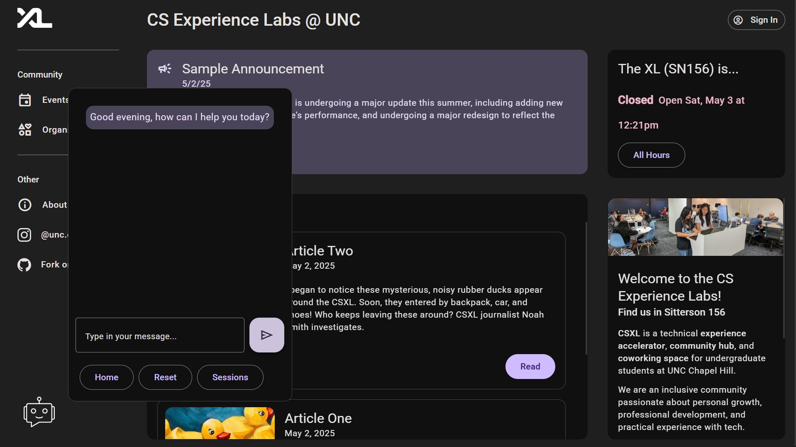
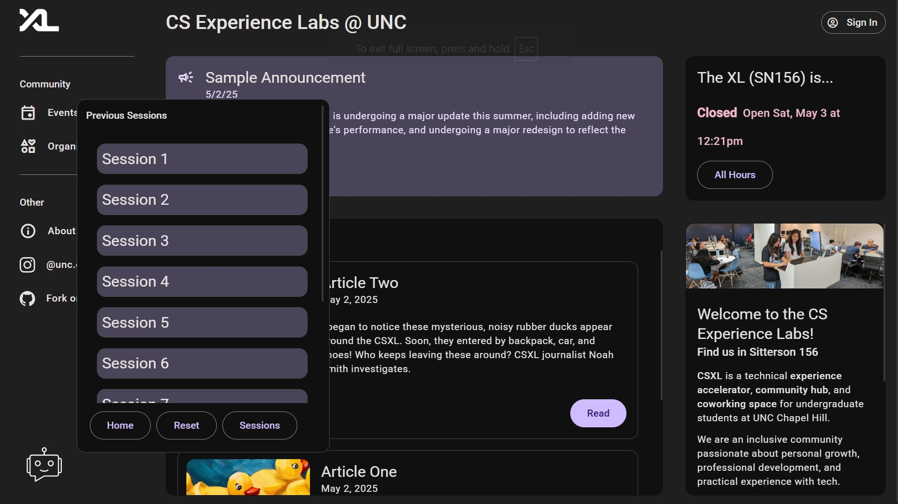

# Chatbot Documentation

> Written by: [Ayush Pai](https://github.com/ayushTheunc), [Daniel Zhang](https://github.com/D123aniel), [Mann Barot](https://github.com/MannBarot/), [Miguel Alvarado Dorado](hhttps://github.com/miguelaa123) <br> _Last Updated: 5/2/25_

## Introduction

This document describes the technical integration of the general-purpose CSXL Chatbot into the CSXL website. It is intended for future developers who may maintain, modify, or improve the chatbot system.

The CSXL Chatbot provides users with the ability to ask questions related to UNC's CSXL Lab. The chatbot uses OpenAI's GPT model, customized with UNC-specific guidelines and restrictions.

All user interactions (user prompts and AI responses) are stored in a PostgreSQL database, organized into chat sessions.

## Frontend

The chatbot frontend is built with Angular and is configured in the `app-chatbot` component. This component is fixed at the bottom left corner of every page.

### User Interface

Clicking the chatbot button opens a popup chat window (`chat-window`)
Inside the window:

- Message list (chat history)
- Input field for typing prompt
- Send button
- Reset button
- Dropdown menu to select past chat sessions


**Figure 1.** _Home view of chatbot._


**Figure 2.** _Session management view of chatbot._

### Angular Services

The `ChatbotServiceService`provides the following methods:

- `postMessage(userMessage, chat_id, api_response, session_id)` ➔ POST user message to backend.
- `getAllMessages(session_id)` ➔ GET all previous messages for a session.
- `getAllSessions()` ➔ GET list of all session IDs.
- `getUserName()` ➔ GET current user's first name from `/api/profile` (to personalize greeting).

### Frontend Code Structure

| File                     | Purpose                                                                                                  |
| ------------------------ | -------------------------------------------------------------------------------------------------------- |
| `chatbot.component.ts`   | Main Angular component controlling chatbot visibility, sending/receiving messages, and session handling. |
| `chatbot.component.html` | Defines the chat window's structure, including messages, input box, buttons, and session dropdown.       |
| `chatbot.component.css`  | Styles the chatbot popup window, message alignment, colors, and layout.                                  |
| `chatbot-services.ts`    | Angular service that handles HTTP communication with backend API endpoints.                              |

### Error Handling

- **Unauthorized Access (403 Forbidden)**
  If the user is not logged in, the chatbot will return:

      > "Sorry, you need to be logged in to use this feature."

- **Other Errors**
  If any other error occurs during message processing, the chatbot will return:

      > "Sorry, I couldn't process your request."

## Backend

The chatbot backend, all located in `backend/..`, consists of the API routing layer(`/api/chatbot`), service layer(`/services/chatbot`), and Pydantic models used for data validation(/models).

### API Routing

We connect the chatbot router to the app by importing and adding it to the list of included routers in main.py. All routes used by the chatbot api have the prefix (`/api/chatbot`), staying consistent with other APIs. We define one POST method to "ask" the ChatGPT API questions and receive a response, one POST method to create a new session, and two GET methods to retrieve Session data from the PostgreSQL database.

All logic and implementations are handled by the service layer, called by each method corresponding to an API route.

```py
@api.post("/chat", tags=["Chatbot"])
def chat(user_message: str, chatbot_service: ChatBotService = Depends()) -> str:
    """
    Send a message to the chatbot api and receive a response
    """
    return chatbot_service.chatbot_response(user_message)
```

This POST method is the main method used to post a request to the API and receive a response. Required parameters:

- `user_message: str`: Text entered by user to be sent to the API. (Example: "What is the CSXL?")
- `chatbot_service: ChatBotService = Depends()`: ChatbotService injected to call the retrieval logic.

```py
@api.post("/create/chat", tags=["Chatbot"])
def createChat(chatbot_service: ChatBotService = Depends()) -> str:
    """
    Send a message to the chatbot api and receive a response
    """
    return chatbot_service.create_new_session()
```

This POST method initializes a new chat session and returns the generated session identifier. Required parameters:

- `chatbot_service: ChatBotSerivce = Depends()`: Service layer injected to call the logic responsible for creation and management.

```py
@api.get("/admin/session/{session_id}", tags=["Chatbot"])
def get_session_history(session_id: int, chatbot_service: ChatBotService = Depends()) -> list[ChatMessageResponse]:
    """
    Get the chat session history for a given session id
    """
    return chatbot_service.get_all_sessionMessages(session_id)
```

This GET method fetches the full message history for a specific chat session. Required parameters:

- `session_id: int`: Unique identifier of the chat session to retrieve.
- `chatbot_serivce = ChatBotService = Depends()`: Service layer injected to retrieve and load chat session messages.

```py
@api.get("/admin/sessions/", tags=["Chatbot"])
def get_available_sessions(chatbot_service: ChatBotService = Depends()) -> list[int]:
    """
    Get the chat session history for a given session id
    """
    return chatbot_service.get_all_sessions()
```

This GET method returns a list of all chat session identifiers. Required parameters:

- `chatbot_service = Depends()`: Service layer used to list existing session identifiers.

### Main Endpoints Summary

| Method | Endpoint                                  | Purpose                                                                                 |
| ------ | ----------------------------------------- | --------------------------------------------------------------------------------------- |
| POST   | `/api/chatbot/chat`                       | Send a simple user prompt to the chatbot and receive a response (no session storage).   |
| POST   | `/api/chatbot/admin/chat`                 | Send a prompt, get a response, and log the interaction to the database under a session. |
| POST   | `/api/chatbot/create/chat`                | Create a new chat session (optional, handled automatically in frontend usually).        |
| GET    | `/api/chatbot/admin/sessions/`            | Retrieve all existing chat session IDs for session selection.                           |
| GET    | `/api/chatbot/admin/session/{session_id}` | Retrieve all messages in a particular chat session (user + bot messages).               |

### Service Layer

Service layer defined in /services/chatbot.py, encapuslates all business logic for creating sessions, sending user prompts to GPT API, and retrieving session chat histories.

#### Class Attributes

- **`chat_id_count: int`**: Tracks the next `chat_id` to assign to each user chat and API response. Initialized to current count of messages stored in the database.
- **`_openapi_svc_: OpenAIService`**: Injected OpenAI service for generating chatbot replies.
- **`_session: Session`**: SQLAlchemy database for all CRUD operations.

#### Class Methods

```py
def ai_response(self, request: ChatMessageResponse) -> str
```

This method is used by the (`/chat`) POST method route to send a user prompt and receive a response from the GPT API. Utilizing the OpenAIService, we define a specific system prompt for the GPT API, and send through the user message as a string using the `.prompt` method. After receiving a response, we update `request` with the chatbot response, and update the chat_id counters. Then, the database is updated with the new ChatMessageresponse, and finally we return the API response as a string.

Parameters:

- `request: ChatMessageResponse`: Model containing user input and associated session id.

Returns:

- `str`: Generated chatbot response.

```py
def get_all_sessionMessages(self, id: int) -> list[ChatMessageResponse]
```

Fetches and returns list of all stored messages for a given session ID by querying ChatMessageResponseEntity. If the query fails, raise exception.

Parameters:

- `id: int`: Chat session identifier

Returns:

- `list[ChatMessageResponse]`: List of all messages in the chat session corresponding to the chat identifier.

```py
def get_all_sessions(self) -> list[int]
```

Retrieves the list of all existing chat session ids by selecting `session_id` from `ChatSessionEntity`. If query fails, raise expection.

Returns:

- `list[int]`: List of all unique existing `session_id`

```py
def create_new_session(self) -> str
```

Creates a new chat session by constructing a new `ChatSessionEntity` with max `session_id` + 1. Registers then commits to database.

Returns:

- `str`: Confirmation message of successful session creation.

### Pydantic Models

These Pydantic models validate all API inputs and outputs, mapping them directly to the database entities with conversion methods. Across layers, they ensure consistent data shape and separation.

`ChatMessageResponse`

A model for a single chat message and api response pair.

- `chat_id: int`: Unique identifier for the chat message.
- `user_prompt: str`: User prompt stored as a string.
- `api_response: str`: Response from the GPT API stored as a string.
- `session_id: int`: The associated session's unique identifier.

`ChatMessageDetails`

An extra model that inherits from ChatMessageResponse, used to return a message plus its session info and avoid circular imports.

`Chat Session`

A model for a chat session, containing the entire message history of a user session.

- `session_id: int`: Unique identifier of this user chat session.
- `onyen: str`: UNC onyen (username) of the user associated with this session.
- `user: PublicUser`: Public information of the user associated with this session.

`ChatSessionDetails`

An extra model that inhereits from ChatSession, used to return a session along with its full list of messages while avoiding circular imports.

## Database Integration

The CSXL chatbot integration stores all user interactions and AI responses in a **PostgreSQL database**, accessed through **SQLAlchemy ORM** models.

This allows sessions and messages to be saved, retrieved, and analyzed later.

Each chatbot interaction is stored in two related tables:

- `chat_session` ➔ Represents a single user session (a "chat session").
- `chat_message_response` ➔ Represents individual messages exchanged in that session.

### Entities

`chat_session` (defined in `chat_session_entity.py`)

| Field      | Type                                        | Notes                                                   |
| ---------- | ------------------------------------------- | ------------------------------------------------------- |
| session_id | Integer (Primary Key)                       | Auto-incremented unique session identifier.             |
| onyen      | String                                      | UNC user identifier.                                    |
| user_id    | Integer                                     | User ID of the session creator.                         |
| message    | Relationship to `ChatMessageResponseEntity` | Back reference for retrieving messages in this session. |

---

#### `chat_message_response` (defined in `chat_message_entity.py`)

| Field        | Type                                    | Notes                                                    |
| ------------ | --------------------------------------- | -------------------------------------------------------- |
| chat_id      | Integer (Primary Key)                   | Auto-incremented unique identifier for the chat message. |
| user_prompt  | String (max 1000 characters)            | The text of the user’s question/prompt.                  |
| api_response | String                                  | The chatbot's response text (no length restriction).     |
| session_id   | Integer (Foreign Key to `chat_session`) | Associates this message with a chat session.             |
| session      | Relationship to `ChatSessionEntity`     | ORM relationship back to the session.                    |

### Relationships

- One-to-many: Each session can contain multiple user and AI messages (chat_session ➔ chat_message_response)
- Messages can be fetched in order for a given session using the `session` relationship, which allows the frontend to easily reconstruct and display full chat histories.

## AI Integration

The Chatbot utilizes the ChatBotService in `/services/chatbot.py` for all backend logic, which relies on the OpenAIService defined in `/services/openai.py`.

The OpenAIService uses a private local environment vairable `UNC_OPENAI_API_KEY` which isn't pushed or exposed in the repo. It is kept out of version control, and only accessible through references in the code.

To use your own OpenAI API key in your developer environment:

1. Navigate to your `backend\.env` file (steps to setup can be found in the [CSXL Development Environment instructions](https://github.com/unc-csxl/csxl.unc.edu/blob/main/docs/get_started.md)).
2. Then, create a new variable called `UNC_OPENAI_API_KEY`, and set the value to your OpenAI API key (lowercase, no spaces or dashes).

The function utilized in the OpenAIService is `OpenAIService.prompt()`, where we pass in the system and user prompts, and receive back a response model of our choice. In our case, we choose to return back an `OpenAIChatbotResponse` instance. We then save the data to the appropriate place in the database, and return the AI response as a string.

### Create Your Own Model

To create your own custom response model, create a new class in the `/models` folder. The model should inherit from BaseModel, which can be imported: `from pydantic import BaseModel`. Next, declare exactly which fields you expect from the AI's output. Each field should be named accurately to the type of data it will hold, and have its appropriate type annotation assigned to it.

Then, in whatever service or route you're using the `OpenAIService` in, import your new model and pass it as the `response_model` argument in `OpenAIService.prompt()`. The data will then automatically get parsed by Pydantic into the appropriate fields using the model's field names and type annotations, which is why it is crucial to use appropriate names and type annotations for your model fields.
